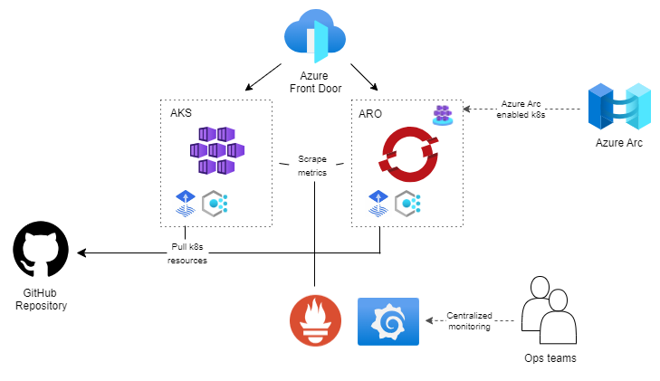

# Multiplatform environment: AKS & ARO

## Introduction

The purpose of this project is to create a (simple) multiplatform environment with AKS and ARO clusters.
This is **not a production ready environment**, it is just a simple environment to demonstrate some scenarios.

The high level architecture is the following:



## Environment variables

We will start by setting a set of environment variables used in the next scenarios. 

Set your owns, but you can use the following as a reference:

```bash
export RESOURCE_GROUP=multiplatform-rg
export AKS_CLUSTER_NAME=aks-mp
export ARO_CLUSTER_NAME=aro-mp
export LOCATION=<location>
```	

## Create Resource Groups

```bash
az group create --name $RESOURCE_GROUP --location $LOCATION
```

## Create AKS cluster

```bash
az aks create \
    --resource-group $RESOURCE_GROUP \
    --name $AKS_CLUSTER_NAME \
    --node-count 3 \
    --enable-managed-identity \
    --location $LOCATION \
    --enable-addons http_application_routing \
    --generate-ssh-keys
```

## Connect to AKS cluster

```bash
az aks get-credentials --resource-group $RESOURCE_GROUP --name $AKS_CLUSTER_NAME
```

Set DNS Zone for AKS cluster:

```bash
export DNS_ZONE=$(az aks show \
    --resource-group $RESOURCE_GROUP \
    --name $AKS_CLUSTER_NAME \
    --query addonProfiles.httpApplicationRouting.config.HTTPApplicationRoutingZoneName -o tsv)
```

## Create ARO cluster

Get a pull secret from [Red Hat OpenShift Cluster Manager](https://learn.microsoft.com/en-us/azure/openshift/tutorial-create-cluster#get-a-red-hat-pull-secret-optional).

1. Create Vnet and Subnets

```bash
az network vnet create \
    --resource-group $RESOURCE_GROUP \
    --name aro-vnet \
    --address-prefixes 10.0.0.0/22 \
    --location $LOCATION

az network vnet subnet create \
    --resource-group $RESOURCE_GROUP \
    --vnet-name aro-vnet \
    --name master-subnet \
    --address-prefixes 10.0.0.0/23

az network vnet subnet create \
  --resource-group $RESOURCE_GROUP \
  --vnet-name aro-vnet \
  --name worker-subnet \
  --address-prefixes 10.0.2.0/23
```	

2. Create ARO cluster

```bash
az aro create \
  --resource-group $RESOURCE_GROUP \
  --location $LOCATION \
  --name $ARO_CLUSTER_NAME \
  --vnet aro-vnet \
  --master-subnet master-subnet \
  --worker-subnet worker-subnet \
  --pull-secret @pull-secret.txt
```

5. Login to ARO cluster 

Get the kubeadmin password and API server URL:

```bash
export KUBEADMIN_PWD=$(az aro list-credentials \
  --name $ARO_CLUSTER_NAME \
  --resource-group $RESOURCE_GROUP \
  --query kubeadminPassword -o tsv)
export API_SERVER=$(az aro show \
  --name $ARO_CLUSTER_NAME \
  --resource-group $RESOURCE_GROUP \
  --query apiserverProfile.url -o tsv)
export CLUSTER_DOMAIN=$(az aro show \
  --name $ARO_CLUSTER_NAME \
  --resource-group $RESOURCE_GROUP \
  --query clusterProfile.domain -o tsv)
```

Login to ARO cluster:

```bash
oc login $API_SERVER -u kubeadmin -p $KUBEADMIN_PWD
```

4. Connect ARO cluster to Arc

Ensure you are logged in the ARO cluster and run:

```bash
./tools/aro-connect-to-arc.sh $ARO_CLUSTER_NAME $RESOURCE_GROUP $LOCATION
```

## Scenarios

### Scenario 1: Deploy a simple application using GitOps

1. Install Flux on AKS cluster
    
```bash
az k8s-extension create --name fluxv2  --extension-type microsoft.flux --scope cluster --cluster-name $AKS_CLUSTER_NAME --resource-group $RESOURCE_GROUP --cluster-type managedClusters
```

2. Install Flux on ARO cluster

```bash
NS="flux-system"
oc adm policy add-scc-to-user nonroot system:serviceaccount:$NS:kustomize-controller
oc adm policy add-scc-to-user nonroot system:serviceaccount:$NS:helm-controller
oc adm policy add-scc-to-user nonroot system:serviceaccount:$NS:source-controller
oc adm policy add-scc-to-user nonroot system:serviceaccount:$NS:notification-controller
oc adm policy add-scc-to-user nonroot system:serviceaccount:$NS:image-automation-controller
oc adm policy add-scc-to-user nonroot system:serviceaccount:$NS:image-reflector-controller
az k8s-extension create --name fluxv2  --extension-type microsoft.flux --scope cluster --cluster-name $ARO_CLUSTER_NAME --resource-group $RESOURCE_GROUP --cluster-type connectedClusters
```

Follow instructions to deploy a simple application using GitOps. Below command will create a GitOps configuration in AKS/ARO clusters to deploy a simple application from a GitHub repository (GitRepository and the Kustomization k8s resources).

1. For AKS:

NOTE: Before applying this command, fork the [repository](https://github.com/dsanchor/flux-sample-app) and modify the ingress.yaml file to use the DNS Zone created in AKS cluster (file located in ./overlays/aks/ingress.yaml).

Init the repository url, use your own forked repository:

```bash
export REPO_URL=https://github.com/dsanchor/flux-sample-app
```


```bash
az k8s-configuration flux create -g $RESOURCE_GROUP \
    -c $AKS_CLUSTER_NAME \
    -n sample-app \
    --namespace flux-system \
    -t managedClusters \
    --scope cluster \
    -u $REPO_URL \
    --branch main  \
    --kustomization name=app path=./overlays/aks prune=true 
```	

2. For ARO:

```bash
az k8s-configuration flux create -g $RESOURCE_GROUP \
    -c $ARO_CLUSTER_NAME \
    -n sample-app \
    --namespace flux-system \
    -t connectedClusters \
    --scope cluster \
    -u $REPO_URL \
    --branch main  \
    --kustomization name=app path=./overlays/aro prune=true 
```

Test the application by accessing in the browser to the following urls:

```bash	
echo "AKS: http://bgd.$DNS_ZONE"
echo "ARO: http://bgd-demo.apps.$CLUSTER_DOMAIN.$LOCATION.aroapp.io"
```

### Scenario 2: Load balance traffic between AKS and ARO clusters with Front Door

The next step is to create a Front Door to load balance traffic between AKS and ARO clusters. 

Following steps are obtained from [this](https://learn.microsoft.com/en-gb/azure/frontdoor/create-front-door-cli) article.

1. Create a Front Door Profile

```bash
az afd profile create --profile-name demoafd --resource-group $RESOURCE_GROUP --sku Standard_AzureFrontDoor 
```

2. Create a Front Door Endpoint

```bash
az afd endpoint create \
    --resource-group $RESOURCE_GROUP \
    --endpoint-name demofrontend \
    --profile-name demoafd \
    --enabled-state Enabled
```

3. Create a Front Door Origin Group

```bash
az afd origin-group create \
    --resource-group $RESOURCE_GROUP \
    --origin-group-name demoog \
    --profile-name demoafd \
    --probe-request-type GET \
    --probe-protocol Http \
    --probe-interval-in-seconds 60 \
    --probe-path / \
    --sample-size 4 \
    --successful-samples-required 3 \
    --additional-latency-in-milliseconds 50
```

Add AKS origin to origin group:

```bash	
az afd origin create \
    --resource-group $RESOURCE_GROUP \
    --host-name bgd.$DNS_ZONE \
    --profile-name demoafd \
    --origin-group-name demoog \
    --origin-name aks \
    --origin-host-header bgd.$DNS_ZONE \
    --priority 1 \
    --weight 1000 \
    --enabled-state Enabled \
    --http-port 80 \
    --https-port 443
```

Add ARO origin to origin group:

```bash
az afd origin create \
    --resource-group $RESOURCE_GROUP \
    --host-name bgd-demo.apps.$CLUSTER_DOMAIN.$LOCATION.aroapp.io \
    --profile-name demoafd \
    --origin-group-name demoog \
    --origin-name aro \
    --origin-host-header bgd-demo.apps.$CLUSTER_DOMAIN.$LOCATION.aroapp.io \
    --priority 1 \
    --weight 1000 \
    --enabled-state Enabled \
    --http-port 80 \
    --https-port 443
```

4. Create a Front Door Routing Rule

```bash
az afd route create \
    --resource-group $RESOURCE_GROUP \
    --profile-name demoafd \
    --endpoint-name demofrontend \
    --forwarding-protocol MatchRequest \
    --route-name demoroute \
    --origin-group demoog \
    --supported-protocols Http \
    --link-to-default-domain Enabled
```

5. Test

```bash
export FRONTEND=$(az afd endpoint show \
    --resource-group $RESOURCE_GROUP \
    --endpoint-name demofrontend \
    --profile-name demoafd \
    --query hostName -o tsv)
```

Test the application by accessing in the browser to the following urls:

```bash
echo "Front Door: http://$FRONTEND"
```

6. Update AKS origin to become the backup origin

```bash
az afd origin update \
    --resource-group $RESOURCE_GROUP \
    --profile-name demoafd \
    --origin-group-name demoog \
    --origin-name aks \
    --priority 2 
```

### Scenario 3: Configure managed prometheus and managed grafana in AKS and ARO clusters

1. Create an Azure Monitor Workspace

```bash
az monitor account create \
    --name demoamw \
    --resource-group $RESOURCE_GROUP \
    --location $LOCATION
export WORKSPACE_ID=$(az monitor account show \
    --resource-group $RESOURCE_GROUP \
    --name demoamw \
    --query id -o tsv)
```

2. Create a managed Grafana

```bash
az grafana create \
    --name demomg \
    --resource-group $RESOURCE_GROUP \
    --location $LOCATION 
export GRAFANA_ID=$(az grafana show \
    --name demomg \
    --resource-group $RESOURCE_GROUP \
    --query id -o tsv)
```

3. Configure AKS cluster

```bash
az aks update --enable-azure-monitor-metrics \
    -n $AKS_CLUSTER_NAME \
    -g $RESOURCE_GROUP \
    --azure-monitor-workspace-resource-id $WORKSPACE_ID \
    --grafana-resource-id  $GRAFANA_ID
```

4. Configure ARO cluster

Follow steps from this [guide](https://learn.microsoft.com/en-us/azure/openshift/howto-remotewrite-prometheus).


### Scenario 4: Configure Azure Policies to enforce security and compliance

Documentation for Azure Policy for AKS and ARC connected k8s clusters can be found [here](https://learn.microsoft.com/en-us/azure/governance/policy/concepts/policy-for-kubernetes#overview).

1. Install Azure Policy add-on on AKS cluster

```bash
az aks enable-addons \
    --resource-group $RESOURCE_GROUP \
    --name $AKS_CLUSTER_NAME \
    --addons azure-policy
```

Validate installation:

```bash
# azure-policy pod is installed in kube-system namespace
kubectl get pods -n kube-system | grep azure-policy

# azure-policy components are running
kubectl get pods -n gatekeeper-system
```

2. Install Azure Policy extension for the ARO connected cluster

```bash
az k8s-extension create \
    --cluster-type connectedClusters \
    --cluster-name $ARO_CLUSTER_NAME \
    --resource-group $RESOURCE_GROUP \
    --extension-type Microsoft.PolicyInsights \
    --name azurepolicy 
```

NOTE: demo for Azure Policies is still on the way... meanwhile, you can check the complience status in Azure Portal.